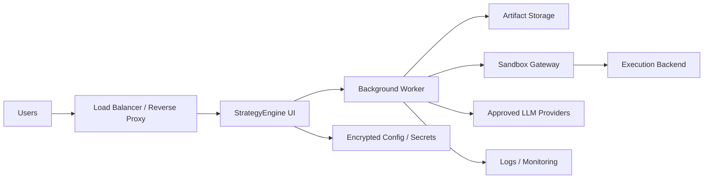

# StrategyEngine AI - Customer Deployment Guide

## Purpose

This guide is written for two audiences:

- the StrategyEngine team, so they know how to explain the product during sales and technical validation
- the customer, so they understand how the product should be deployed inside their infrastructure

It is intentionally practical.

## One-Line Positioning

StrategyEngine AI is a **self-hosted enterprise AI analytics appliance** that runs inside the customer's infrastructure, with:

- a web UI for operators
- background execution for long runs
- isolated code execution for ML and data engineering
- customer-controlled secrets, storage, and sandbox compute

## What To Say In A Sales Call

Use this framing:

1. The product is deployed in your environment, not ours.
2. Your team configures API keys, models, and execution backend from the UI.
3. Generated code runs in an isolated sandbox, ideally inside your own cloud or internal boundary.
4. Datasets, runs, logs, reports, and artifacts remain under your control.
5. We can start with a lightweight pilot deployment and later harden it into a standard production topology.

Do not lead with:

- "It's just a Streamlit app"
- "It's basically a Python tool"
- "You'll run an `.exe`"

That language makes the product sound non-enterprise.

## The Correct Mental Model For The Customer

The customer should think of StrategyEngine AI as:

```text
Web application
  + background worker
  + isolated execution backend
  + persistent run storage
  + encrypted configuration
```

Not as:

```text
desktop program
  or
single script
```

## Deployment Options

## Option A - Pilot Deployment

Recommended when:

- this is the first paid pilot
- there are only a few users
- the customer wants something fast to validate

Recommended shape:

- 1 host or VM
- Docker Compose
- 1 application container
- mounted persistent volumes
- local worker subprocess
- local sandbox or remote sandbox gateway

This is the fastest way to get to value.

## Option B - Production Self-Hosted

Recommended when:

- the customer has IT or security review
- several users need access
- the system will be used repeatedly

Recommended shape:

- web UI service
- worker service
- artifact storage
- metadata store
- secrets store
- sandbox gateway
- centralized logs

This is the correct enterprise target.

## Option C - Private Managed Deployment

Recommended when:

- the customer wants low operational burden
- StrategyEngine is willing to operate dedicated customer environments

Recommended shape:

- same architecture as production self-hosted
- but operated in a dedicated tenant or cloud account

## What The Customer Must Provide

At minimum:

- a host or cloud environment where the product can run
- outbound access to allowed LLM providers, if required
- a place to persist runs and artifacts
- an admin owner for initial setup

For stronger deployments:

- a reverse proxy or load balancer
- secret management
- centralized logs
- internal authentication or SSO
- an isolated sandbox backend

## What The Customer Configures In The UI

The customer should not need to edit internal files.

From the UI, they configure:

- API keys
- model routing
- sandbox mode
- remote sandbox gateway settings
- execution backend settings

That is the correct operating model.

## Recommended Customer Infrastructure Topology



## Sandbox Recommendation

This is the most important technical recommendation:

**the code execution backend should live inside the customer's own infrastructure boundary**

That can mean:

- local execution for low-risk pilots
- a remote sandbox gateway inside their cloud or on-prem environment

This answers the customer's biggest questions:

- where does the code run?
- where does the data live?
- who controls the compute?
- how is isolation handled?

Reference:

- [SANDBOX_GATEWAY.md](C:/Users/santi/Projects/Hackathon_Gemini_Agents/SANDBOX_GATEWAY.md)

## Practical Deployment Sequence

### Step 1 - Pilot

Use:

- [Dockerfile](C:/Users/santi/Projects/Hackathon_Gemini_Agents/Dockerfile)
- [docker-compose.yml](C:/Users/santi/Projects/Hackathon_Gemini_Agents/docker-compose.yml)

Goal:

- prove value
- validate connectivity
- verify sandbox choice
- generate the first successful runs

### Step 2 - Security Review

Review with the customer:

- where secrets are stored
- where artifacts are stored
- where generated code executes
- what outbound network access is required
- what audit logs are retained

### Step 3 - Production Hardening

Move toward:

- separate UI and worker services
- internal storage service or object storage
- proper auth / SSO
- operational monitoring
- backup and retention policy

## Questions To Ask The Customer Early

Ask these in the first technical session:

1. Do you want the product fully inside your VPC/on-prem environment?
2. Are you comfortable with outbound traffic to LLM providers, or do you require a private gateway/proxy?
3. Do you want local execution for pilots, or must all execution be isolated from day one?
4. Do you already have a preferred execution backend: Kubernetes, Cloud Run, VMs, Batch, internal sandbox?
5. Do you require SSO from the start?
6. What storage and retention policy do you require for datasets and generated artifacts?

Those answers determine the right deployment shape quickly.

## Recommended Answers To Common Customer Questions

### "Is this a desktop app?"

Recommended answer:

No. It is a self-hosted web product with background execution and isolated sandboxing. It can run locally for a pilot, but the professional model is deployment inside your infrastructure.

### "Where does the data go?"

Recommended answer:

The system is designed to run inside your environment. Datasets, runs, artifacts, and reports remain under your control.

### "Where does generated code execute?"

Recommended answer:

In an isolated execution backend. For enterprise deployments, we recommend that backend lives inside your own cloud or internal execution boundary.

### "Do we need to edit config files?"

Recommended answer:

No. The intended operating model is UI-first configuration for API keys, models, and sandbox/backend settings.

### "Can we start small and harden later?"

Recommended answer:

Yes. The recommended path is pilot on Docker Compose, then production hardening once value is validated.

## Responsibilities Matrix

### StrategyEngine Team

- provide the application images and deployment guidance
- define the sandbox integration contract
- support initial configuration and validation
- document upgrade paths and operational expectations

### Customer IT / Platform Team

- provide runtime infrastructure
- provide network/security controls
- provide secret ownership
- decide where sandbox execution lives
- own production operations if self-hosted

### Customer Business / Analytics Team

- define use cases
- upload data or configure approved sources
- validate outputs and reports
- decide operational usage of generated recommendations

## Best First Enterprise Offer

If a company is interested today, the best professional offer is:

1. a pilot deployment using Docker Compose in their environment
2. UI-based configuration of keys and execution backend
3. either local sandbox for pilot or remote sandbox gateway in their cloud
4. a later production hardening phase if the pilot succeeds

That is realistic, defensible, and commercially credible.

## Bottom Line

If the customer asks "how should we deploy this?", the short answer is:

**Deploy it as a self-hosted web platform with background workers and isolated execution, ideally inside your own infrastructure. Start with Docker Compose for pilot, then evolve to a production topology once value is proven.**
