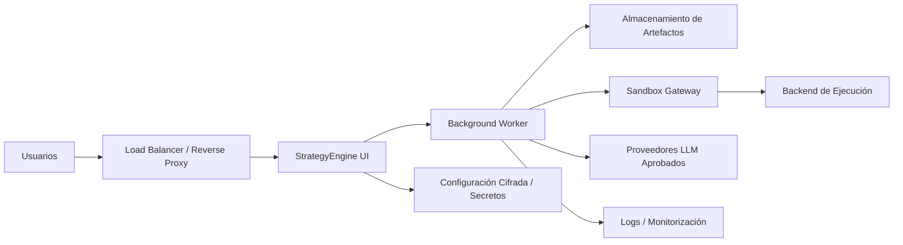

# StrategyEngine AI - Guía de Despliegue para Cliente

## Propósito

Esta guía está escrita para dos audiencias:

- el equipo de StrategyEngine, para saber cómo explicar el producto durante ventas y validación técnica
- el cliente, para que entienda cómo debe desplegar el producto dentro de su propia infraestructura

La guía es deliberadamente práctica.

## Posicionamiento en Una Línea

StrategyEngine AI es un **appliance enterprise de analítica con IA, self-hosted**, que corre dentro de la infraestructura del cliente y ofrece:

- una UI web para operadores
- ejecución en background para runs largas
- ejecución aislada de código para ML y data engineering
- secretos, almacenamiento y compute del sandbox bajo control del cliente

## Qué Decir en una Llamada Comercial

Usa este framing:

1. El producto se despliega en vuestro entorno, no en el nuestro.
2. Vuestro equipo configura API keys, modelos y backend de ejecución desde la UI.
3. El código generado corre en un sandbox aislado, idealmente dentro de vuestra nube o perímetro interno.
4. Datasets, runs, logs, informes y artefactos quedan bajo vuestro control.
5. Podemos empezar con un piloto ligero y endurecerlo después hasta una topología estándar de producción.

No abras la conversación con frases como:

- "Es solo una app de Streamlit"
- "Es básicamente una herramienta Python"
- "Ejecutáis un `.exe`"

Ese lenguaje hace que el producto parezca menos enterprise de lo que es.

## Modelo Mental Correcto para el Cliente

El cliente debe pensar en StrategyEngine AI como:

```text
Aplicación web
  + worker en background
  + backend de ejecución aislado
  + almacenamiento persistente de runs
  + configuración cifrada
```

No como:

```text
programa de escritorio
  o
script suelto
```

## Opciones de Despliegue

## Opción A - Piloto

Recomendada cuando:

- es el primer piloto de pago
- hay pocos usuarios
- el cliente quiere validar rápido

Topología recomendada:

- 1 host o VM
- Docker Compose
- 1 contenedor principal
- volúmenes persistentes montados
- worker local como subprocess
- sandbox local o gateway remoto

Es la forma más rápida de demostrar valor.

## Opción B - Producción Self-Hosted

Recomendada cuando:

- hay revisión IT o seguridad
- varios usuarios necesitan acceso
- el sistema se va a usar de forma repetida

Topología recomendada:

- servicio de UI web
- servicio worker
- almacenamiento de artefactos
- metadata store
- secret store
- sandbox gateway
- logging centralizado

Esta es la forma correcta de operar en enterprise.

## Opción C - Private Managed Deployment

Recomendada cuando:

- el cliente quiere poca carga operativa
- StrategyEngine está dispuesto a operar un entorno dedicado por cliente

Topología recomendada:

- misma arquitectura que producción self-hosted
- operada por StrategyEngine en un tenant o cuenta cloud dedicada

## Qué Debe Aportar el Cliente

Como mínimo:

- un host o entorno cloud donde correr el producto
- salida de red hacia los proveedores LLM autorizados, si aplica
- un lugar donde persistir runs y artefactos
- un administrador responsable del setup inicial

Para despliegues más robustos:

- reverse proxy o load balancer
- secret management
- logs centralizados
- autenticación interna o SSO
- backend aislado de sandbox

## Qué Configura el Cliente Desde la UI

El cliente no debería editar archivos internos.

Desde la UI configura:

- API keys
- routing de modelos
- modo de sandbox
- gateway remoto del sandbox
- backend de ejecución

Ese es el modelo operativo correcto.

## Topología Recomendada en la Infraestructura del Cliente



## Recomendación sobre el Sandbox

Es la recomendación técnica más importante:

**el backend de ejecución del código debe vivir dentro del perímetro de infraestructura del cliente**

Eso puede significar:

- ejecución local para pilotos de bajo riesgo
- o un sandbox gateway remoto dentro de su cloud o entorno on-prem

Esto responde a las preguntas clave del cliente:

- dónde corre el código
- dónde viven los datos
- quién controla el compute
- cómo se gestiona el aislamiento

Referencia:

- [SANDBOX_GATEWAY.md](C:/Users/santi/Projects/Hackathon_Gemini_Agents/SANDBOX_GATEWAY.md)

## Variables de Entorno de Rutas

El sistema resuelve todas sus rutas internas desde un módulo centralizado (`src/utils/paths.py`). Por defecto se auto-detectan relativas al directorio del proyecto, pero en despliegues enterprise se pueden sobreescribir con variables de entorno para apuntar a almacenamiento externo sin tocar código.

| Variable | Default | Propósito |
|----------|---------|-----------|
| `PROJECT_ROOT` | Auto-detectado desde `paths.py` | Raíz del proyecto. Todos los demás paths se derivan de aquí si no se sobreescriben individualmente. |
| `RUNS_DIR` | `{PROJECT_ROOT}/runs` | Directorio donde se almacenan todas las runs (workspace, logs, artefactos, reportes). Es el volumen con mayor crecimiento. |
| `DATA_DIR` | `{PROJECT_ROOT}/data` | Directorio de datos compartidos: uploads de CSV, configuración cifrada de API keys, overrides de modelos. |

Ejemplo de uso en un despliegue con almacenamiento externo:

```bash
export RUNS_DIR=/mnt/shared/strategyengine/runs
export DATA_DIR=/mnt/shared/strategyengine/data
```

En Docker Compose, los volúmenes del host se configuran con las variables `RUNS_VOLUME` y `DATA_VOLUME`:

```bash
RUNS_VOLUME=/mnt/nas/runs DATA_VOLUME=/mnt/nas/data docker compose up -d
```

Importante: estas tres variables son las únicas que un equipo de IT necesita conocer para integrar el almacenamiento del producto con la infraestructura del cliente.

## Consideraciones para Almacenamiento en Red (NAS / NFS / EFS)

Si el cliente requiere almacenamiento compartido o persistente en red, el sistema es compatible pero hay que tener en cuenta:

### Escrituras atómicas

El sistema usa `os.replace()` para actualizar archivos de estado (`worker_status.json`) de forma atómica. Este patrón funciona correctamente en filesystems locales y en la mayoría de mounts NFS v4+. En mounts NFS v3 o SMB/CIFS antiguos, `os.replace()` puede no ser atómico, lo cual podría causar lecturas parciales del archivo de estado en condiciones de alta concurrencia.

Recomendación: usar NFS v4+ o un filesystem POSIX-compliant (EFS, GCS FUSE, Azure Files con protocolo NFS).

### Latencia de I/O

El Data Engineer y ML Engineer generan artefactos de tamaño moderado (CSVs limpios, modelos, plots). En almacenamiento con latencia alta (>5ms por operación), las runs pueden ser más lentas. No hay riesgo de corrupción, solo de rendimiento.

Recomendación para pilotos: usar disco local y copiar artefactos a red después. Para producción: mount NFS/EFS con throughput adecuado (>100 MB/s recomendado).

### Permisos y ownership

Los directorios de runs y datos deben ser escribibles por el proceso del contenedor (UID 0 por defecto en el Dockerfile actual, o el UID configurado si se usa `USER` en un Dockerfile custom).

Recomendación: verificar que el mount point tenga permisos `rwx` para el UID del proceso antes del primer arranque.

### Bloqueo de archivos

El sistema no usa file locking (`flock`, `fcntl`). Cada run opera en su propio directorio aislado, por lo que no hay contención entre runs concurrentes. Sin embargo, no se recomienda que dos workers escriban en el mismo `run_id` simultáneamente.

## Secuencia Práctica de Despliegue

### Paso 1 - Piloto

Usar:

- [Dockerfile](C:/Users/santi/Projects/Hackathon_Gemini_Agents/Dockerfile)
- [docker-compose.yml](C:/Users/santi/Projects/Hackathon_Gemini_Agents/docker-compose.yml)

Objetivo:

- demostrar valor
- validar conectividad
- confirmar el tipo de sandbox
- generar las primeras runs exitosas

### Paso 2 - Revisión de Seguridad

Revisar con el cliente:

- dónde se almacenan los secretos
- dónde se guardan los artefactos
- dónde se ejecuta el código generado
- qué salida de red hace falta
- qué logs de auditoría se conservan

### Paso 3 - Hardening de Producción

Evolucionar hacia:

- separación entre UI y worker
- storage interno u object storage
- auth / SSO adecuados
- monitorización operativa
- política de backup y retención

## Preguntas que Debes Hacer al Cliente al Principio

Haz estas preguntas en la primera sesión técnica:

1. ¿Queréis el producto completamente dentro de vuestra VPC o entorno on-prem?
2. ¿Aceptáis tráfico saliente hacia proveedores LLM o necesitáis gateway/proxy privado?
3. ¿Os sirve ejecución local en piloto o todo debe ir aislado desde el día uno?
4. ¿Ya tenéis backend preferido: Kubernetes, Cloud Run, VMs, Batch o sandbox interno?
5. ¿Necesitáis SSO desde el principio?
6. ¿Qué política de almacenamiento y retención exigís para datasets y artefactos?

Esas respuestas determinan muy rápido la forma correcta del despliegue.

## Respuestas Recomendadas a Preguntas Típicas

### "¿Es una app de escritorio?"

Respuesta recomendada:

No. Es un producto web self-hosted con ejecución en background y sandbox aislado. Puede correr localmente para un piloto, pero el modelo profesional es desplegarlo dentro de vuestra infraestructura.

### "¿Dónde van los datos?"

Respuesta recomendada:

El sistema está pensado para ejecutarse dentro de vuestro entorno. Datasets, runs, artefactos e informes quedan bajo vuestro control.

### "¿Dónde se ejecuta el código generado?"

Respuesta recomendada:

En un backend de ejecución aislado. Para despliegues enterprise, recomendamos que ese backend esté dentro de vuestra nube o perímetro interno.

### "¿Tenemos que editar archivos de configuración?"

Respuesta recomendada:

No. El modelo operativo previsto es configuración desde la UI para API keys, modelos y sandbox/backend.

### "¿Podemos empezar pequeño y endurecer después?"

Respuesta recomendada:

Sí. El camino recomendado es piloto con Docker Compose y, si valida valor, fase posterior de hardening a producción.

## Matriz de Responsabilidades

### Equipo StrategyEngine

- proporcionar imágenes de aplicación y guía de despliegue
- definir el contrato de integración del sandbox
- acompañar la configuración inicial y la validación
- documentar upgrades y expectativas operativas

### Equipo IT / Plataforma del Cliente

- proporcionar infraestructura runtime
- proporcionar controles de red y seguridad
- gestionar los secretos
- decidir dónde vive el sandbox
- operar producción si el despliegue es self-hosted

### Equipo de Negocio / Analítica del Cliente

- definir casos de uso
- subir datos o conectar fuentes aprobadas
- validar outputs e informes
- decidir cómo usar operativamente las recomendaciones generadas

## Mejor Oferta Enterprise Inicial

Si una empresa se interesa hoy, la mejor oferta profesional es:

1. un piloto con Docker Compose en su entorno
2. configuración desde la UI de claves y backend de ejecución
3. sandbox local para piloto o gateway remoto dentro de su cloud
4. una fase posterior de hardening de producción si el piloto funciona

Es una propuesta realista, defendible y comercialmente sólida.

## Conclusión

Si el cliente pregunta "¿cómo debemos desplegar esto?", la respuesta corta es:

**Desplegadlo como una plataforma web self-hosted con workers en background y ejecución aislada, idealmente dentro de vuestra propia infraestructura. Empezad con Docker Compose para el piloto y evolucionad después a una topología de producción cuando el valor esté demostrado.**
