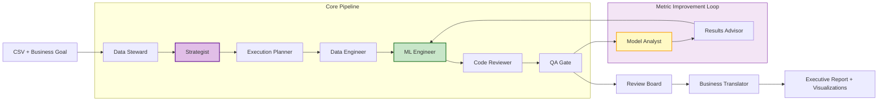

# StrategyEngine AI

### Autonomous Multi-Agent Data Science System


---

## What is StrategyEngine AI?

**StrategyEngine AI** is an autonomous Data Science department powered by AI. Upload a CSV (or connect a CRM), describe your business objective, and a team of **13 specialized AI agents** — orchestrated by **LangGraph** and powered by **configurable LLMs via OpenRouter** — collaborates end-to-end to deliver production-grade ML models with optimized metrics.

The system audits your data, formulates analytical strategies, compiles an execution contract, generates and executes ML code in a sandboxed environment, validates results through multiple review gates, **iteratively improves model metrics through an optimization loop**, generates LLM-driven visualizations, and translates everything into an executive business report — all autonomously.

---

## Architecture



> The pipeline includes a **metric improvement loop** (up to 12 optimization rounds) with patience-based early stopping, monotonic degradation detection, and adaptive viability filtering.

---

## The Agent Team

**13 specialized agents**, each with a distinct role mirroring a high-performing data science organization:

### Core Pipeline

| Agent | Role | LLM |
|-------|------|-----|
| **Data Steward** | Ingests, audits, and profiles raw data. Detects encoding issues, missing values, dialect quirks, and anomalies. | Gemini |
| **Strategist** | Formulates optimal analytical strategies with progressive optimization phases (baseline, feature engineering, HPO, variance reduction, stacking). | OpenRouter (configurable) |
| **Execution Planner** | Compiles the execution contract: column roles, derived column rules, QA gates, artifact requirements, timeout budgets, and visualization plan. | Gemini |
| **Data Engineer** | Generates cleaning and transformation scripts. Produces EDA visualizations with LLM-driven plot reasoning. | OpenRouter (configurable) |
| **ML Engineer** | Writes production-ready ML code: feature engineering, model training, cross-validation, ensembling, and predictions. Generates model result visualizations. | OpenRouter (configurable) |
| **Code Reviewer** | Static analysis and safety scanning of generated code before execution. | Gemini |
| **QA Gate** | Enforces quality assertions with HARD/SOFT severity rules on outputs and metrics. | Gemini |
| **Model Analyst** | Analyzes baseline model code and metrics to produce an optimization blueprint with concrete improvement actions. | OpenRouter (inherits Strategist model) |
| **Results Advisor** | Generates critique packets analyzing metric improvements, stability, and generalization gaps. | Gemini |
| **Review Board** | Final decision authority — approves, rejects, or flags results with limitations. | Gemini |
| **Business Translator** | Converts technical metrics into ROI impact, business risks, and strategic recommendations. Interprets visualizations narratively for the executive report. | Gemini |

### Support Agents

| Agent | Role |
|-------|------|
| **Cleaning Reviewer** | Validates data transformation integrity after cleaning scripts run. |
| **Failure Explainer** | Diagnoses runtime errors and proposes targeted fixes for retry iterations. |

---

## Key Features

### Metric Improvement Loop

The core differentiator: after the initial model is built, the system enters an **automated optimization loop**:

1. **Model Analyst** analyzes the baseline code and generates an optimization blueprint with prioritized improvement actions
2. **ML Engineer** implements each hypothesis, executes, and evaluates
3. **Results Advisor** critiques the candidate vs incumbent metric
4. System decides: keep improvement or restore baseline

**Loop controls:**
- **Patience**: configurable tolerance for consecutive non-improvements (default: 5)
- **Monotonic degradation detection**: auto-stops after 2 consecutive rounds of metric regression
- **Adaptive min_delta**: calibrates improvement threshold to the statistical noise floor of each dataset
- **Budget-aware**: respects script timeout (7200s hard limit) with 50/50 HPO/final-model budget rule

### Contract-Driven Execution

An **Execution Contract** compiled by the Execution Planner governs every run: column role mapping, derived column rules, QA gate assertions (HARD/SOFT severity), reviewer gates, artifact requirements, visualization plan, and validation strategy. The contract is validated by a schema registry and auto-repair pipeline before any code is generated.

### LLM-Driven Visualizations

Agents reason about which visualizations to create based on the data and strategy — no hardcoded charts. The Data Engineer creates EDA plots during cleaning; the ML Engineer generates model result plots (feature importance, confusion matrices, learning curves). Each agent writes factual `plot_summaries.json` metadata that the Business Translator interprets narratively in the executive report.

### Sandboxed Code Execution

All generated code runs in an isolated sandbox. The system supports two execution modes through a **universal gateway protocol**:
- **Local sandbox**: Direct local execution for development and testing
- **Remote sandbox**: HTTP-based gateway to external execution environments (Cloud Run, etc.)

Both modes implement the same interface (`files.write`, `files.read`, `commands.run`), ensuring identical behavior. See [SANDBOX_GATEWAY.md](SANDBOX_GATEWAY.md) for the gateway specification.

### Self-Healing ML Pipelines

The ML Engineer operates in a **retry loop of up to 12 attempts**. When code fails execution or validation, the Failure Explainer diagnoses the issue and the engineer generates a corrected version — autonomously.

### Configurable LLM Per Agent

Select the optimal LLM for each agent role directly from the Streamlit UI:

**Available presets:**
- GLM-5 (default, cost-effective)
- Kimi K2.5
- Minimax M-2.5
- DeepSeek V3.2
- Claude Opus 4.6 (premium reasoning)
- GPT-5.3 Codex (premium code generation)
- GPT-5.4 (latest)
- Custom OpenRouter model ID

Model overrides persist across sessions and apply to: **Strategist**, **Data Engineer**, **ML Engineer**, and **Model Analyst** (inherits Strategist model).

### Real-Time Execution Dashboard

A live Streamlit dashboard shows:
- **Pipeline progress** with stage tracker and elapsed time
- **Execution Plan** tab with full contract details (problem type, metric, dependencies, runbook, gates)
- **Metric improvement tracking** across optimization rounds
- **Activity log** with timestamped agent messages
- **Estimated cost** badge based on API call budget counters
- **Model configuration panel** for per-agent LLM selection
- **Run history** with downloadable artifacts and submissions

### Data Connectors

Built-in connectors for ingesting data from external sources:
- **Salesforce** — query objects via SOQL
- **HubSpot** — contacts, deals, companies
- **Dynamics 365** — OData entities
- **Excel** — `.xlsx` / `.xls` file conversion

### Run History & Dataset Memory

- Every run is persisted with full event logs, metrics, and artifacts
- **Dataset memory** carries learnings across runs on the same dataset
- Run events are auditable via `runs/<run_id>/events.jsonl`

---

## Installation & Usage

### 1. Clone the Repository
```bash
git clone https://github.com/your-org/strategy-engine-ai.git
cd strategy-engine-ai
```

### 2. Install Dependencies
```bash
pip install -r requirements.txt
```

### 3. Bootstrap Environment

Copy `.env.example` to `.env`.

The product is now **UI-first** for commercial deployment:
- **API keys** are configured from the sidebar and stored in the encrypted local key store
- **Agent models** are configured from the sidebar and persisted as runtime overrides
- **Sandbox / execution backend** are configured from the sidebar and persisted in the sandbox config store

`.env` is only a **bootstrap / fallback** file and should stay minimal:

```env
OPENROUTER_TIMEOUT_SECONDS=120
RUN_EXECUTION_MODE=local
```

Do not store production secrets in `.env` if the UI store is available.

### 4. Run
```bash
streamlit run app.py
```

### 5. Configure the Runtime from the UI

In the Streamlit sidebar, configure:
- **API Keys**
- **Models**
- **Sandbox de ejecucion**
- **Backend de ejecucion**

Changes persist automatically and are used by the background worker on new runs.

---

## How It Works

```
 1. Upload      Upload a CSV file (or connect a CRM) and describe your business goal
 2. Audit       Data Steward profiles data, detects issues, samples intelligently
 3. Strategize  Strategist generates strategy with progressive optimization phases
 4. Plan        Execution Planner compiles the full execution contract
 5. Clean       Data Engineer generates transformation scripts + EDA visualizations
 6. Build       ML Engineer writes ML code (baseline model with CV) + result visualizations
 7. Validate    Code Reviewer + QA Gate enforce quality standards
 8. Optimize    Model Analyst generates optimization blueprint;
                Improvement loop iterates: hypothesis > implement > evaluate > keep/revert
                (up to 12 rounds with early stopping)
 9. Finalize    Review Board approves; Business Translator generates executive report
                with narrative interpretation of all visualizations
10. Deliver     Submission CSV + metrics + executive PDF report
```

---

## Project Structure

```
strategyengine-ai/
  app.py                            # Streamlit frontend + run orchestration
  src/
    agents/                         # 13 specialized AI agents
      steward.py                    # Data profiling and audit
      strategist.py                 # Strategy generation + iteration dispatch
      execution_planner.py          # Execution contract compilation
      data_engineer.py              # Data cleaning code generation
      ml_engineer.py                # ML code generation
      model_analyst.py              # Optimization blueprint generation
      reviewer.py                   # Code review
      qa_reviewer.py                # Quality gate assertions
      results_advisor.py            # Metric analysis and critique
      review_board.py               # Final approval authority
      business_translator.py        # Technical to business translation
      cleaning_reviewer.py          # Data transformation validation
      failure_explainer.py          # Runtime error diagnosis
    graph/
      graph.py                      # LangGraph workflow definition
      steps/                        # Modular pipeline step helpers
    connectors/                     # CRM and file connectors
    utils/                          # 85+ utility modules
      sandbox_provider.py           # Universal sandbox gateway (local/remote)
      contract_validator.py         # Contract validation pipeline
      contract_schema_registry.py   # Schema auto-repair
      metric_eval.py                # Metric extraction and evaluation
      llm_fallback.py               # Multi-model fallback chains
      run_status.py                 # File-based run status protocol
      background_worker.py          # Subprocess-based graph execution
      ...
  cloudrun/
    heavy_runner/                   # Remote sandbox execution service
  tests/                            # 1300+ tests (252 test files)
  .streamlit/config.toml            # Streamlit configuration
  requirements.txt                  # Python dependencies
```

---

## Configuration

| Environment Variable | Default | Description |
|---------------------|---------|-------------|
| `GOOGLE_API_KEY` | -- | Gemini API key (required) |
| `OPENROUTER_API_KEY` | -- | OpenRouter API key (required) |
| `SANDBOX_GATEWAY_URL` | -- | Remote sandbox gateway URL (optional, uses local execution if unset) |
| `OPENROUTER_TIMEOUT_SECONDS` | `120` | Request timeout for OpenRouter calls |

---

## Testing

```bash
# Run the full test suite
python -m pytest tests/ -q

# Run smoke tests only (no LLM calls)
python -m pytest tests/test_agent_smoke_imports.py -q
```

---

*Built for autonomous, production-grade ML pipeline automation.*
