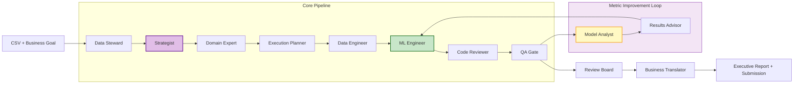

# 🏭 StrategyEngine AI

### Autonomous Multi-Agent Data Science System


---

## 🚀 What is StrategyEngine AI?

**StrategyEngine AI** is an autonomous Data Science department powered by AI. Upload a CSV, describe your business objective, and a team of **14 specialized AI agents** — orchestrated by **LangGraph** and powered by **configurable LLMs via OpenRouter** — collaborates end-to-end to deliver production-grade ML models with optimized metrics.

The system audits your data, formulates analytical strategies, generates and executes ML code in a sandboxed environment, validates results through multiple review gates, **iteratively improves model metrics through an optimization loop**, and translates technical results into actionable business recommendations — all autonomously.

---

## 🏗️ Architecture



> The pipeline includes a **metric improvement loop** (up to 12 optimization rounds) with patience-based early stopping, monotonic degradation detection, and adaptive viability filtering.

---

## 🤖 The Agent Team

**14 specialized agents**, each with a distinct role mirroring a high-performing data science organization:

### Core Pipeline

| Agent | Role | LLM |
|-------|------|-----|
| **👮 Data Steward** | Ingests, audits, and profiles raw data. Detects encoding issues, missing values, and anomalies. | Gemini |
| **🧠 Strategist** | Formulates optimal analytical strategies with progressive optimization phases (baseline → FE → HPO → variance reduction → stacking). | OpenRouter (configurable) |
| **🎯 Domain Expert** | Scores and selects the best strategy evaluating business alignment, feasibility, and data sufficiency. | MIMO |
| **📋 Execution Planner** | Designs the execution blueprint: dataset profile, column roles, timeout settings, QA gates, and resource plan. | Gemini |
| **🔧 Data Engineer** | Generates cleaning and transformation scripts to prepare data for modeling. | OpenRouter (configurable) |
| **🛠️ ML Engineer** | Writes production-ready ML code: feature engineering, model training, cross-validation, ensembling, and predictions. | OpenRouter (configurable) |
| **📝 Code Reviewer** | Static analysis and safety scanning of generated code before execution. | Gemini |
| **✅ QA Gate** | Enforces quality assertions with HARD/SOFT severity rules on outputs and metrics. | Gemini |
| **🔬 Model Analyst** | Analyzes baseline model code and metrics to produce an **optimization blueprint** with concrete improvement actions. Reasons about late-stage techniques (stacking, multi-seed, target encoding, pseudo-labeling). | OpenRouter (inherits Strategist model) |
| **📊 Results Advisor** | Generates critique packets analyzing metric improvements, stability, and generalization gaps. | MIMO / Gemini |
| **🏛️ Review Board** | Final decision authority — approves, rejects, or flags results with limitations. | Gemini |
| **💼 Business Translator** | Converts technical metrics into ROI impact, business risks, and strategic recommendations. | Gemini |

### Support Agents

| Agent | Role |
|-------|------|
| **🔍 Cleaning Reviewer** | Validates data transformation integrity after cleaning scripts run. |
| **🐛 Failure Explainer** | Diagnoses runtime errors and proposes targeted fixes for retry iterations. |

---

## ✨ Key Features

### 🔄 Metric Improvement Loop

The core differentiator: after the initial model is built, the system enters an **automated optimization loop**:

1. **Model Analyst** analyzes the baseline code and generates an **optimization blueprint** with prioritized improvement actions
2. **Strategist** (deterministic mode) dispatches blueprint actions one by one
3. **ML Engineer** implements each hypothesis, executes, and evaluates
4. **Results Advisor** critiques the candidate vs incumbent metric
5. System decides: keep improvement or restore baseline

**Loop controls:**
- **Patience**: configurable tolerance for consecutive non-improvements (default: 5)
- **Monotonic degradation detection**: auto-stops after 2 consecutive rounds of metric regression
- **Adaptive min_delta**: calibrates improvement threshold to the statistical noise floor of each dataset
- **Budget-aware**: respects script timeout (7200s hard limit) with 50/50 HPO/final-model budget rule

### 🧠 Optimization Blueprint (Late-Stage Techniques)

The Model Analyst reasons about advanced techniques that separate good models from competitive ones:

| Technique | Description | Typical Gain |
|-----------|-------------|-------------|
| **Multi-seed averaging** | Train same pipeline with 5+ random seeds, average predictions | +0.001–0.003 |
| **Stacking (2-level)** | OOF predictions from diverse base learners → meta-learner | +0.001–0.005 |
| **Target encoding** | K-fold regularized encoding for categoricals (prevents leakage) | +0.0005–0.002 |
| **Pseudo-labeling** | High-confidence test predictions as additional training data | +0.0005–0.002 |
| **Optuna HPO** | Bayesian hyperparameter optimization with budget-aware trial limits | +0.001–0.003 |
| **Probability calibration** | Isotonic/Platt scaling for probability-based metrics | +0.0005–0.001 |

The **adaptive viability filter** ensures expensive techniques (multi-seed, stacking) are never discarded — instead, they're adapted to fit within the compute budget (fewer seeds, reduced CV folds, subsampling).

### ⚙️ Configurable LLM Per Agent

Select the optimal LLM for each agent role directly from the Streamlit UI:

**Available presets:**
- GLM-5 (default, cost-effective)
- Kimi K2.5
- Minimax M-2.5
- DeepSeek V3.2
- Claude Opus 4.6 (premium reasoning)
- GPT-5.3 Codex (premium code generation)
- GPT-5.4 (latest)
- Custom OpenRouter model ID

Model overrides persist across sessions and apply to: **Strategist**, **Data Engineer**, **ML Engineer**, and **Model Analyst** (inherits Strategist model).

### 🛡️ Contract-Driven Validation

An **Execution Contract** governs every run: column role mapping, derived column rules, QA gate assertions (HARD/SOFT severity), reviewer gates, artifact requirements, and validation strategy. Nothing ships without passing the contract.

### 🔧 Self-Healing ML Pipelines

The ML Engineer operates in a **retry loop of up to 12 attempts**. When code fails execution or validation, the Failure Explainer diagnoses the issue and the engineer generates a corrected version — autonomously.

### 📊 Real-Time Execution Dashboard

A live Streamlit dashboard shows:
- **Pipeline progress** with stage tracker
- **Elapsed time** counter
- **Metric improvement tracking** across optimization rounds
- **Activity log** with timestamped agent messages
- **Model configuration panel** for per-agent LLM selection
- **Run history** with downloadable artifacts and submissions

### 📈 Run History & Dataset Memory

- Every run is persisted with full event logs, metrics, blueprints, and artifacts
- **Dataset memory** carries learnings across runs on the same dataset
- Run events are auditable via `runs/<run_id>/events.jsonl`

---

## 🛠️ Installation & Usage

### 1. Clone the Repository
```bash
git clone https://github.com/your-repo/strategy-engine-ai.git
cd strategy-engine-ai
```

### 2. Install Dependencies
```bash
pip install -r requirements.txt
```

### 3. Configure Environment

Create a `.env` file in the root directory:

```env
# Required: Google Gemini (core reasoning agents)
GOOGLE_API_KEY=your_gemini_api_key

# Required: OpenRouter (ML Engineer, Data Engineer, Strategist, Model Analyst)
OPENROUTER_API_KEY=your_openrouter_api_key

# Optional: MIMO (Domain Expert, Results Advisor)
MIMO_API_KEY=your_mimo_api_key
```

All OpenRouter-routed agents use a single API key. Model selection is done per-agent from the Streamlit UI (no need to configure individual model env vars).

### 4. Run
```bash
streamlit run app.py
```

### 5. Configure Models (Optional)

In the Streamlit sidebar, click **Model Settings** to select LLMs per agent. Changes persist automatically.

---

## 📊 How It Works

```
 1. Upload      → Provide a CSV file and describe your business goal
 2. Audit       → Data Steward profiles data, detects issues, samples intelligently
 3. Strategize  → Strategist generates strategy with progressive optimization phases;
                   Domain Expert selects the best approach
 4. Plan        → Execution Planner designs the full ML execution blueprint
 5. Clean       → Data Engineer generates transformation scripts
 6. Build       → ML Engineer writes ML code (baseline model with CV)
 7. Validate    → Code Reviewer + QA Gate enforce quality standards
 8. Optimize    → Model Analyst generates optimization blueprint;
                   Improvement loop iterates: hypothesis → implement → evaluate → keep/revert
                   (up to 12 rounds with early stopping)
 9. Finalize    → Review Board approves; Business Translator generates executive report
10. Deliver     → Submission CSV + metrics + downloadable report
```

---

## 🧪 Example Use Cases

- **Customer Churn Prediction** — Upload customer data, get a stacking ensemble with multi-seed averaging that maximizes AUC-ROC
- **Sales Forecasting** — Provide historical sales data, receive optimized regression models with trend analysis
- **Lead Scoring** — Feed CRM data, get a prioritized lead ranking with calibrated conversion probabilities
- **Fraud Detection** — Submit transaction logs, receive anomaly classification with optimized precision-recall

---

## 📂 Project Structure

```
├── app.py                          # Streamlit frontend + LangGraph execution
├── src/
│   ├── agents/                     # 14 specialized AI agents
│   │   ├── steward.py              # Data profiling and audit
│   │   ├── strategist.py           # Strategy generation + iteration hypothesis
│   │   ├── domain_expert.py        # Strategy evaluation
│   │   ├── execution_planner.py    # Execution blueprint design
│   │   ├── data_engineer.py        # Data cleaning code generation
│   │   ├── ml_engineer.py          # ML code generation
│   │   ├── model_analyst.py        # Optimization blueprint generation
│   │   ├── reviewer.py             # Code review
│   │   ├── qa_reviewer.py          # Quality gate assertions
│   │   ├── results_advisor.py      # Metric analysis and critique
│   │   ├── review_board.py         # Final approval authority
│   │   ├── business_translator.py  # Technical → business translation
│   │   ├── cleaning_reviewer.py    # Data transformation validation
│   │   └── failure_explainer.py    # Runtime error diagnosis
│   ├── graph/
│   │   └── graph.py                # LangGraph workflow definition (~25K lines)
│   └── utils/
│       ├── metric_eval.py          # Metric extraction and evaluation
│       ├── llm_fallback.py         # Multi-model fallback chains
│       └── ...
├── runs/                           # Persisted run history
├── .streamlit/config.toml          # Streamlit configuration
└── requirements.txt
```

---

## ⚙️ Advanced Configuration

| Environment Variable | Default | Description |
|---------------------|---------|-------------|
| `GOOGLE_API_KEY` | — | Gemini API key (required) |
| `OPENROUTER_API_KEY` | — | OpenRouter API key (required) |
| `MIMO_API_KEY` | — | MIMO API key (optional) |
| `STRATEGIST_ITERATION_MODE` | `deterministic` | Hypothesis generation mode: `deterministic`, `llm`, or `hybrid` |
| `MODEL_ANALYST_MODE` | `hybrid` | Blueprint generation mode: `deterministic`, `llm`, or `hybrid` |
| `OPT_DEGRADATION_THRESHOLD` | `0.0` | Cumulative delta threshold for monotonic degradation early stop |
| `OPENROUTER_TIMEOUT_SECONDS` | `120` | Request timeout for OpenRouter calls |

---

*Built for competitive ML pipeline automation — from baseline to leaderboard.*
