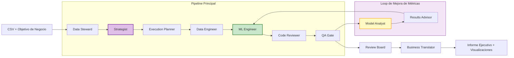

# StrategyEngine AI

### Sistema Autónomo Multiagente de Data Science


---

## Qué es StrategyEngine AI

**StrategyEngine AI** es un departamento autónomo de Data Science impulsado por IA. Subes un CSV, o conectas un CRM, describes tu objetivo de negocio y un equipo de **13 agentes especializados** coordinados con **LangGraph** y alimentados por **LLMs configurables vía OpenRouter** colabora de extremo a extremo para entregar modelos de ML listos para producción con métricas optimizadas.

El sistema audita los datos, formula estrategias analíticas, compila un contrato de ejecución, genera y ejecuta código de ML en un entorno aislado, valida resultados con múltiples puertas de revisión, **mejora iterativamente las métricas mediante un loop de optimización**, genera visualizaciones y traduce todo a un informe ejecutivo de negocio, todo ello de forma autónoma.

---

## Arquitectura



> El pipeline incluye un **loop de mejora de métricas** con hasta 12 rondas de optimización, parada temprana basada en paciencia, detección de degradación monotónica y filtrado adaptativo de viabilidad.

---

## El Equipo de Agentes

**13 agentes especializados**, cada uno con un rol equivalente al de una organización de Data Science de alto rendimiento.

### Pipeline Principal

| Agente | Rol | LLM |
|-------|-----|-----|
| **Data Steward** | Ingesta, audita y perfila los datos brutos. Detecta problemas de encoding, valores ausentes, dialectos CSV y anomalías. | Gemini |
| **Strategist** | Formula estrategias analíticas óptimas con fases progresivas de optimización: baseline, feature engineering, HPO, reducción de varianza y stacking. | OpenRouter (configurable) |
| **Execution Planner** | Compila el contrato de ejecución: roles de columnas, reglas de derivadas, QA gates, artefactos requeridos, presupuestos de timeout y plan de visualización. | Gemini |
| **Data Engineer** | Genera scripts de limpieza y transformación. Produce visualizaciones EDA con razonamiento guiado por LLM. | OpenRouter (configurable) |
| **ML Engineer** | Escribe código de ML listo para producción: features, entrenamiento, validación cruzada, ensembles y predicciones. Genera visualizaciones de resultados del modelo. | OpenRouter (configurable) |
| **Code Reviewer** | Hace análisis estático y escaneo de seguridad del código generado antes de ejecutarlo. | Gemini |
| **QA Gate** | Aplica validaciones de calidad con reglas HARD/SOFT sobre outputs y métricas. | Gemini |
| **Model Analyst** | Analiza el baseline y sus métricas para generar un blueprint de optimización con acciones concretas de mejora. | OpenRouter (hereda el modelo del Strategist) |
| **Results Advisor** | Genera críticas estructuradas sobre mejoras métricas, estabilidad y generalización. | Gemini |
| **Review Board** | Autoridad final de decisión: aprueba, rechaza o valida con limitaciones. | Gemini |
| **Business Translator** | Convierte métricas técnicas en impacto de negocio, riesgos y recomendaciones estratégicas. Interpreta visualizaciones de forma narrativa para el informe ejecutivo. | Gemini |

### Agentes de Soporte

| Agente | Rol |
|-------|-----|
| **Cleaning Reviewer** | Valida la integridad de las transformaciones tras ejecutar scripts de limpieza. |
| **Failure Explainer** | Diagnostica errores de runtime y propone fixes dirigidos para reintentos. |

---

## Funcionalidades Clave

### Loop de Mejora de Métricas

El principal diferencial del producto: después de construir el modelo inicial, el sistema entra en un **loop de optimización automatizado**:

1. **Model Analyst** analiza el baseline y genera un blueprint de optimización con acciones priorizadas.
2. **ML Engineer** implementa cada hipótesis, ejecuta y evalúa.
3. **Results Advisor** critica el candidate frente al incumbent.
4. El sistema decide si conserva la mejora o restaura el baseline.

**Controles del loop**
- **Patience**: tolerancia configurable a no-mejoras consecutivas.
- **Detección de degradación monotónica**: detiene automáticamente cuando detecta regresión sostenida.
- **`min_delta` adaptativo**: calibra el umbral de mejora según el ruido estadístico del dataset.
- **Consciente del presupuesto**: respeta límites de tiempo y de ejecución durante la optimización.

### Ejecución Gobernada por Contrato

Un **Execution Contract** compilado por el Execution Planner gobierna cada run: mapping de columnas, reglas de derivadas, QA gates, artefactos requeridos, plan de visualización y estrategia de validación. Ese contrato se valida y repara antes de que se genere código.

### Visualizaciones Guiadas por LLM

Los agentes razonan qué gráficos deben crearse en función de los datos y de la estrategia. El Data Engineer genera EDA durante la limpieza y el ML Engineer crea gráficos de resultados del modelo. Cada agente produce `plot_summaries.json` con facts que el Business Translator interpreta narrativamente.

### Ejecución de Código en Sandbox

Todo el código generado corre en un entorno aislado. El sistema soporta dos modos de ejecución mediante un **protocolo universal de gateway**:
- **Sandbox local**: ejecución directa en local para desarrollo y pruebas.
- **Sandbox remoto**: gateway HTTP hacia entornos externos de ejecución, por ejemplo Cloud Run.

Ambos modos implementan la misma interfaz (`files.write`, `files.read`, `commands.run`). Consulta [SANDBOX_GATEWAY.md](SANDBOX_GATEWAY.md) para la especificación.

### Pipelines de ML Autorreparables

El ML Engineer funciona en un **retry loop de hasta 12 intentos**. Cuando el código falla en ejecución o validación, el Failure Explainer diagnostica el problema y el ingeniero genera una versión corregida.

### LLM Configurable por Agente

Desde la UI de Streamlit se puede seleccionar el LLM óptimo para cada rol.

**Presets disponibles**
- GLM-5
- Kimi K2.5
- Minimax M-2.5
- DeepSeek V3.2
- Claude Opus 4.6
- GPT-5.3 Codex
- GPT-5.4
- Un `model ID` personalizado de OpenRouter

Los overrides persisten entre sesiones y aplican a **Strategist**, **Data Engineer**, **ML Engineer** y **Model Analyst**.

### Dashboard de Ejecución en Tiempo Real

La UI muestra en vivo:
- Progreso del pipeline con tracker por etapas y tiempo transcurrido.
- Pestaña de **Execution Plan** con el contrato completo.
- Seguimiento de la mejora de métricas por ronda.
- Log de actividad con mensajes fechados por agente.
- Coste estimado según contadores de llamadas API.
- Panel de configuración de modelos.
- Historial de runs con artefactos descargables.

### Conectores de Datos

Conectores integrados para ingestión desde fuentes externas:
- **Salesforce**
- **HubSpot**
- **Dynamics 365**
- **Excel**

### Historial de Runs y Memoria de Dataset

- Cada run se persiste con eventos, métricas y artefactos.
- La **dataset memory** arrastra aprendizajes entre runs del mismo dataset.
- Los eventos son auditables en `runs/<run_id>/events.jsonl`.

---

## Instalación y Uso

### 1. Clonar el repositorio
```bash
git clone https://github.com/your-org/strategy-engine-ai.git
cd strategy-engine-ai
```

### 2. Instalar dependencias
```bash
pip install -r requirements.txt
```

### 3. Preparar el entorno

Copia `.env.example` a `.env`.

El producto está pensado ya en modo **UI-first**:
- Las **API keys** se configuran desde la barra lateral y se guardan en el almacén local cifrado.
- Los **modelos de agentes** se configuran desde la barra lateral y se persisten como overrides.
- El **sandbox / backend de ejecución** se configura desde la barra lateral y se persiste en el store de configuración del sandbox.

`.env` debe quedar como un archivo de bootstrap mínimo:

```env
OPENROUTER_TIMEOUT_SECONDS=120
RUN_EXECUTION_MODE=local
```

No guardes secretos de producción en `.env` si la UI ya está disponible.

### 4. Arrancar la aplicación
```bash
streamlit run app.py
```

### 5. Configurar el runtime desde la UI

En la barra lateral de Streamlit configura:
- **API Keys**
- **Modelos**
- **Sandbox de ejecución**
- **Backend de ejecución**

Los cambios persisten automáticamente y se usan en nuevas runs.

---

## Cómo Funciona

```text
 1. Subida       Subes un CSV o conectas un CRM y defines tu objetivo de negocio
 2. Auditoría    Data Steward perfila los datos y detecta incidencias
 3. Estrategia   Strategist genera la estrategia analítica
 4. Plan         Execution Planner compila el contrato de ejecución
 5. Limpieza     Data Engineer genera scripts de transformación y EDA
 6. Construcción ML Engineer escribe el baseline con CV y gráficos de resultados
 7. Validación   Code Reviewer + QA Gate validan calidad y seguridad
 8. Optimización Model Analyst propone mejoras; el loop itera:
                 hipótesis > implementación > evaluación > conservar/revertir
 9. Cierre       Review Board aprueba y Business Translator genera el informe
10. Entrega      CSV final + métricas + informe ejecutivo en PDF
```

---

## Estructura del Proyecto

```text
strategyengine-ai/
  app.py                            # Frontend Streamlit + orquestación
  src/
    agents/                         # 13 agentes especializados
      steward.py                    # Perfilado y auditoría de datos
      strategist.py                 # Generación de estrategia
      execution_planner.py          # Compilación del contrato
      data_engineer.py              # Generación de limpieza
      ml_engineer.py                # Generación de ML
      model_analyst.py              # Blueprint de optimización
      reviewer.py                   # Revisión de código
      qa_reviewer.py                # Puertas de calidad
      results_advisor.py            # Análisis de métricas
      review_board.py               # Aprobación final
      business_translator.py        # Traducción técnica a negocio
      cleaning_reviewer.py          # Validación de limpieza
      failure_explainer.py          # Diagnóstico de errores
    graph/
      graph.py                      # Definición del workflow LangGraph
      steps/                        # Helpers modulares del pipeline
    connectors/                     # Conectores CRM y de ficheros
    utils/                          # Utilidades del sistema
      sandbox_provider.py           # Gateway universal de sandbox
      contract_validator.py         # Validación de contrato
      contract_schema_registry.py   # Auto-reparación de esquema
      metric_eval.py                # Extracción y evaluación de métricas
      llm_fallback.py               # Cadenas de fallback multi-modelo
      run_status.py                 # Protocolo de estado por ficheros
      background_worker.py          # Ejecución en background
      ...
  cloudrun/
    heavy_runner/                   # Servicio remoto de ejecución
  tests/                            # Suite de tests
  .streamlit/config.toml            # Configuración de Streamlit
  requirements.txt                  # Dependencias Python
```

---

## Configuración

| Variable de entorno | Valor por defecto | Descripción |
|---------------------|-------------------|-------------|
| `GOOGLE_API_KEY` | -- | API key de Gemini |
| `OPENROUTER_API_KEY` | -- | API key de OpenRouter |
| `SANDBOX_GATEWAY_URL` | -- | URL del gateway remoto del sandbox |
| `OPENROUTER_TIMEOUT_SECONDS` | `120` | Timeout de llamadas a OpenRouter |

---

## Testing

```bash
# Suite completa
python -m pytest tests/ -q

# Smoke tests sin llamadas LLM
python -m pytest tests/test_agent_smoke_imports.py -q
```

---

*Construido para automatizar pipelines de ML de forma autónoma y orientada a producción.*
